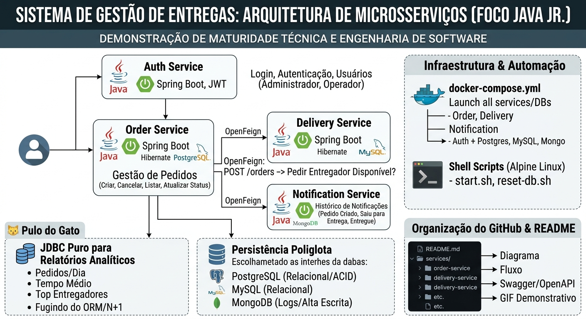

[](README.pt-br.md)

# Delivery Management System

Microservices architecture for order, delivery, authentication, and notification management, developed in Java with Spring Boot.

This project simulates a real-world logistics and distribution ecosystem, featuring independent services, synchronous communication via OpenFeign, JWT authentication, polyglot persistence, and automated infrastructure with Docker Compose.

The main proposal is to demonstrate software engineering best practices, including service-oriented architecture, separation of concerns, scalability, local automation, and the use of appropriate technologies for each business domain.

## System Architecture

The application consists of four microservices, each with specific responsibilities and direct communication with the others:



### 1. Auth Service

Responsible for:

- User authentication;
- Login and authorization;
- JWT token generation and validation;
- Role management, such as administrator and operator.

### 2. Order Service

Responsible for order management:

- Order creation;
- Cancellation;
- Inquiry and listing;
- Status update;
- Event dispatch and integration with deliveries.

### 3. Delivery Service

Responsible for logistics management:

- Querying available delivery drivers;
- Order assignment;
- Delivery and status tracking;
- Delivery operation support.

### 4. Notification Service

Responsible for event history and logging:

- Order creation;
- Status update;
- Delivery notifications;
- System event logging.

## Main Flow

The system's operational flow follows this logic:

1. The user logs into the `Auth Service`;
2. The system returns a JWT token;
3. The authenticated client creates an order in the `Order Service`;
4. The `Order Service` queries the `Delivery Service` to find an available delivery driver;
5. The order is associated with the delivery;
6. The `Notification Service` logs the relevant events;
7. The delivery status is updated throughout the process.

## Polyglot Persistence

The project uses different databases according to the context of each service:

| Database | Service | Purpose |
|---|---|---|
| PostgreSQL | Order Service | Orders and transactional data |
| MySQL | Delivery Service | Relational logistics data |
| MongoDB | Notification Service | Notification and event history |

This approach is known as polyglot persistence and allows choosing the most suitable database for each domain.

## Analytical Reports with JDBC

In addition to using JPA/Hibernate for transactional operations, the `Order Service` also uses plain JDBC for analytical queries and reports.

This strategy is important to avoid performance bottlenecks and common ORM issues, such as:

- N+1 queries;
- Mapping overhead in complex reports;
- Low flexibility for optimized analytical SQL.

Among the expected reports are:

- Orders per day;
- Average delivery time;
- Top performing delivery drivers;
- Operational indicators.

## Infrastructure and Automation

Local execution of the project is automated with Docker Compose and shell scripts.

The infrastructure includes:

- Four microservices;
- PostgreSQL;
- MySQL;
- MongoDB;
- Internal isolated network for communication between containers.

The available scripts help to start, stop, and reset the environment simply.

## Technologies Used

- Java 21;
- Spring Boot;
- Spring Security;
- JWT;
- OpenFeign;
- Hibernate/JPA;
- JDBC;
- PostgreSQL;
- MySQL;
- MongoDB;
- Docker;
- Docker Compose;
- Shell Script;
- Swagger/OpenAPI.

## Demonstration

The demonstration shows how the API and microservices architecture work, including authentication, inter-service communication, order creation and updates, delivery driver querying, and notification logging.

<video
  src="https://github.com/user-attachments/assets/d4bcba4c-901e-4c67-b0fe-d8a3f552f419"
  autoplay
  muted
  playsinline
  controls
  width="100%">
</video>

## How to Run Locally

### Prerequisites

- Git;
- Java 21;
- Docker;
- Docker Compose;
- Bash or compatible shell.

### Clone the Project

```bash
git clone https://github.com/jawc-05/microservices-delivery-logistics-api.git
cd microservices-delivery-logistics-api
```

### Grant Permission to Scripts

```bash
chmod +x start.sh stop.sh reset.sh
```

### Start the Environment

```bash
./start.sh
```

### Stop the Services

```bash
./stop.sh
```

### Reset the Environment

```bash
./reset.sh
```

### Run Directly with Docker Compose

```bash
docker compose up --build
```

To run in the background:

```bash
docker compose up --build -d
```

To view the containers:

```bash
docker compose ps
```

To follow the logs:

```bash
docker compose logs -f
```

## API Documentation

The APIs are documented using Swagger/OpenAPI.

After starting the services, access the documentation at the corresponding address for each application:

```text
http://localhost:<port>/swagger-ui/index.html
```

Ports should be checked in the `docker-compose.yml` file or in the individual service configurations.

## Project Structure

```text
.
├── delivery-logistics-backend/
│   ├── auth-service/
│   ├── order-service/
│   ├── delivery-service/
│   ├── notification-service/
│   └── docs/
│       ├── architecture-diagram.png
│       └── demo.mp4
├── docker-compose.yml
├── start.sh
├── stop.sh
├── reset.sh
├── README.md
└── .gitignore
```

## Possible Improvements

- API Gateway;
- Service Discovery;
- Messaging with RabbitMQ or Kafka;
- Circuit Breaker;
- Integration tests with Testcontainers;
- Monitoring with Prometheus and Grafana;
- Centralized logging;
- CI/CD Pipeline;
- Cloud environment deployment.

## Author

Developed by **João Alfredo Williges Cunha**.

Project aimed at demonstrating microservices architecture, software engineering, and backend development with Java.

## 📝 License
This project is licensed under the MIT License. See the LICENSE file for more details.
